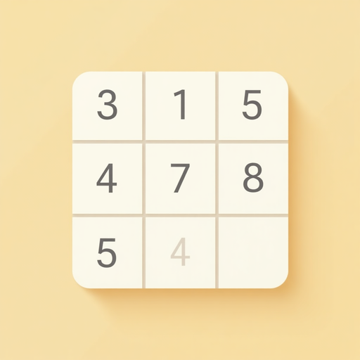

# Zédoku 

Um jogo de Sudoku usando React Native. Desafie sua mente com o "Zedoku"! Níveis variados, dicas e diversão garantida.

## Sobre o Projeto

Zedoku é uma implementação moderna do clássico jogo de Sudoku, desenvolvido com React Native para proporcionar uma experiência de jogo fluida e agradável em dispositivos móveis. O nome "Zedoku" é uma variação criativa do tradicional "Sudoku", já que eu utilizei o nome do meu filho, trazendo uma identidade única ao aplicativo.

O jogo mantém todas as regras tradicionais do Sudoku - preencher uma grade 9x9 com números de 1 a 9, garantindo que cada número apareça apenas uma vez em cada linha, coluna e bloco 3x3. Além disso, o Zedoku incorpora recursos modernos para melhorar a experiência do jogador, como diferentes níveis de dificuldade, sistema de dicas, modo de anotações e cronômetro.

Um professor de matemática me apresentou o jogo no segundo ano do colegial, e nunca mais parei de jogar. Sempre quis fazer um jogo que tivesse minha identidade, só não imaginava que seria tão dificil 🥵.

## Funcionalidades

O Zedoku oferece uma experiência de jogo completa com diversos recursos para jogadores de todos os níveis:

### Sistema de Jogo
- Geração automática de puzzles com solução única garantida.
- Quatro níveis de dificuldade: Fácil, Médio, Difícil e Expert.
- Sistema de vidas que limita o número de erros permitidos.
- Verificação automática de solução para detectar quando o jogo é concluído

### Recursos de Assistência
- Sistema de dicas que revela células aleatórias quando o jogador precisa de ajuda.
- Modo de anotações para registrar possíveis números em cada célula.
- Destaque visual para células com erros, facilitando a correção.
- Interface intuitiva com números grandes e controles de fácil acesso.

### Interface e Experiência
- Design responsivo que se adapta a diferentes tamanhos de tela.
- Suporte a tema escuro, detectando automaticamente as preferências do sistema.
- Cronômetro para medir o tempo de jogo.
- Barra superior informativa com status do jogo (vidas, dicas, tempo).
- Navegação fluida entre telas iniciais e de jogo.

## Tecnologias Utilizadas

O Zedoku foi desenvolvido utilizando as seguintes tecnologias:

- React Native: Framework para desenvolvimento de aplicativos móveis.
- JavaScript: Linguagem de programação principal.
- Expo: Plataforma para facilitar o desenvolvimento e teste.
- React Navigation: Para gerenciamento de navegação entre telas.
- Componentes personalizados: Para criar a experiência única do jogo.

## Instalação e Execução

Para instalar e executar o Zedoku em seu ambiente de desenvolvimento, siga estas etapas:

1. Certifique-se de ter o Node.js instalado em seu sistema
2. Clone este repositório:
   ```
   git clone https://github.com/wstvns/Zedoku
   ```
3. Navegue até o diretório do projeto:
   ```
   cd Zedoku
   ```
4. Instale as dependências:
   ```
   npm install
   ```
5. Inicie o aplicativo com Expo:
   ```
   npx expo start
   ```

Após iniciar o aplicativo, você pode executá-lo em um emulador ou em seu dispositivo físico usando o aplicativo Expo Go.

## Estrutura do Projeto

O projeto está organizado da seguinte forma:

- `/src`: Diretório principal do código-fonte
  - `/components`: Componentes React utilizados no jogo
    - `Board.js`: Implementação do tabuleiro de Sudoku
    - `Cell.js`: Componente para cada célula individual do tabuleiro
    - `GameScreen.js`: Tela principal de jogo com todas as funcionalidades
    - `HomeScreen.js`: Tela inicial com opções de jogo
  - `/utils`: Utilitários e lógica do jogo
    - Funções para geração de puzzles, validação de movimentos e verificação de solução

## Como Jogar

Ao iniciar o Zedoku, você será recebido pela tela inicial onde pode escolher o nível de dificuldade. Após selecionar, o jogo começará com um novo puzzle.

Para jogar:
- Toque em uma célula vazia para selecioná-la.
- Use os botões numéricos na parte inferior para inserir um número.
- Ative o "Modo Notas" para fazer anotações de possíveis números em cada célula.
- Use o botão "X" para limpar uma célula.
- Utilize o botão "Dica" quando precisar de ajuda (somente 3 dicas por jogo).
- Observe o contador de vidas, cada erro vai se embora 1 vida.
- O jogo termina quando você completa o puzzle corretamente ou quando suas vidas acabam.

## Contribuição

Contribuições para o Zedoku são sempre bem vindas! Me ajude a melhorar:

- Reportar bugs
- Sugerir novos recursos
- Enviar pull requests com melhorias

Antes de enviar uma contribuição significativa, por favor abra uma issue para discutir as mudanças propostas.

## Contato

Se você tiver alguma dúvida ou sugestão, sinta-se à vontade para entrar em contato:

- **Email**: [wstevandev@gmail.com](mailto:wstevandev@gmail.com)
- **GitHub**: [wstvns](https://github.com/wstvns)
- **LinkedIn**: [Wallisson Stevan](https://www.linkedin.com/in/wallisson-stevan-985b9375//)
---

Feito com ❤️ por [W. Stevan](https://www.youtube.com/watch?v=wi8yJdKO1j0). ⬅️ abra para uma surpresa!

